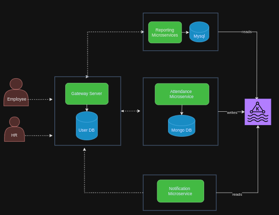

# employeeEvent-attendance-ms

### context diagram

### container diagram

### sequence diagram - swipe (Attendance MS)

### sequence diagram - calculate_total_hours (Attendance MS)

### sequence diagram - entry_status_listener (Report MS)

### sequence diagram - absentee_notification_listener (Notification MS)

### sequence diagram - report generator (Report MS)

